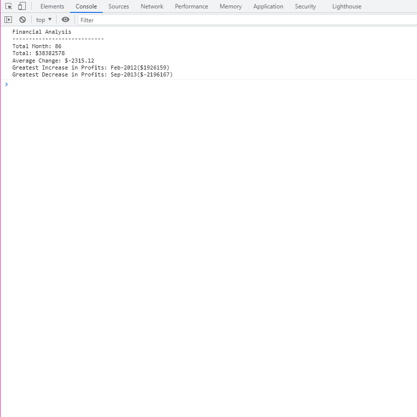

# Console-Finances

## Description

Module 4 challenge - Console Finances. Using newly learnt JavaScript skills analyse the financial records of a company. 

### User Story

Utlising code learnt on the Bootcamp, and from my own research, analyse 86 monthly profit & losses for a "company" to determine several calculations.

### Acceptance Criteria

* To create a repo called `Console Finances`.

* To copy the starter files from the Bootcamp repo to this new one.

* Use JavaScript to calcuate the following

    - The total number of months included in the dataset

    - The net total amount of Profit/Losses over the entire period of the dataset

    - The average of changes in Profit/Losses, tracking the change in profits from month to month, to then find the average

    - The greatest increase in profits, both date, and amount of

    - The greatest decrease in profits, both date, and amount of

    - To log in the browser console the above calculations in the following format

```text
Financial Analysis
----------------------------
Total Months: 25
Total: $2561231
Average  Change: $-2315.12
Greatest Increase in Profits: Feb-2012 ($1926159)
Greatest Decrease in Profits: Sep-2013 ($-2196167)
```

### Deployed Application

View the deployed application for week-3: responsive-portfolio-lesson at [makemassair.github.io](https://makemassair.github.io/Console-Finances).

### Screenshot

